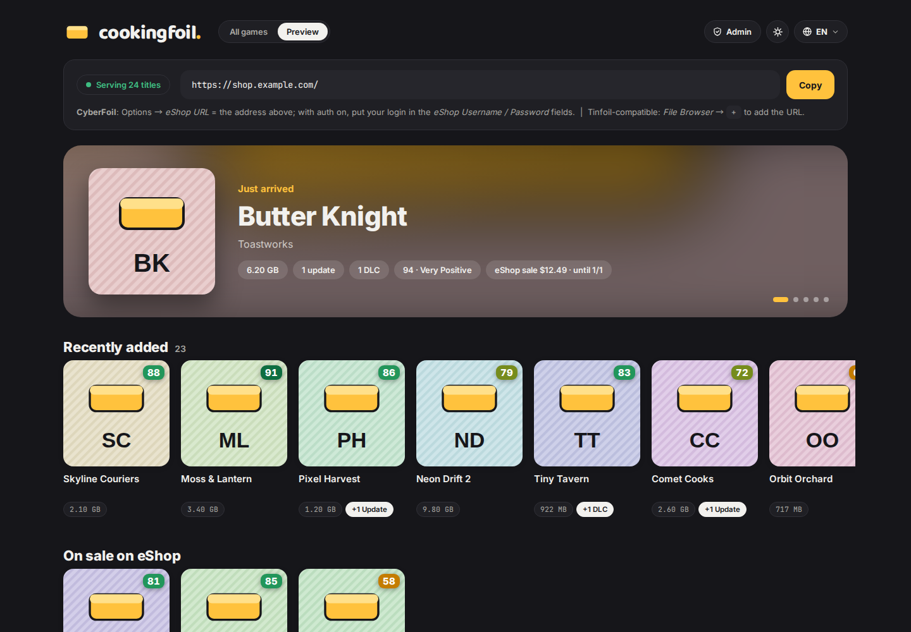
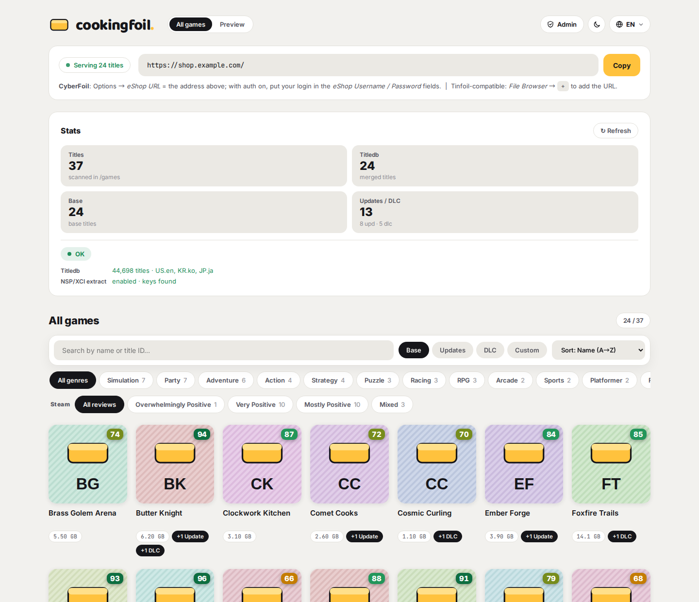
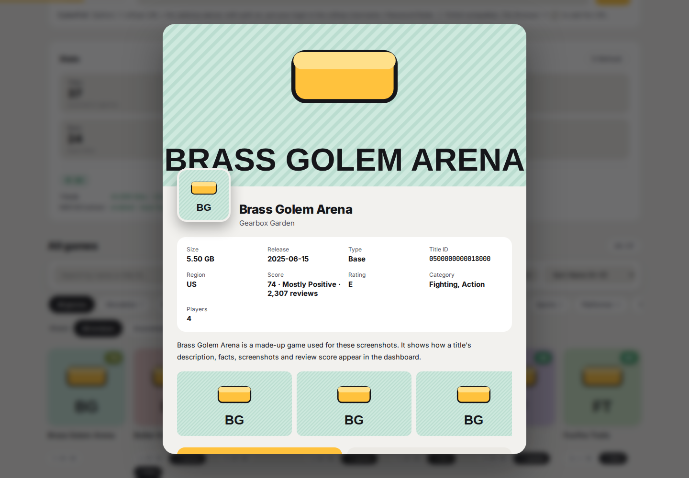
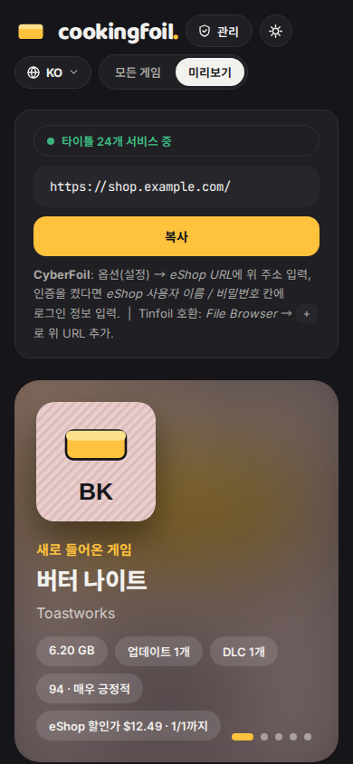

<p align="center">
  <picture>
    <source media="(prefers-color-scheme: dark)" srcset="brand/wordmark-dark.png">
    
  </picture>
</p>

<p align="center">
  A self-hosted shop server for Nintendo Switch homebrew installers.<br>
  First-class <b>CyberFoil</b> support, Tinfoil-compatible, with rich metadata cooked from your own files.
</p>

<p align="center">
  <a href="https://github.com/jshsakura/oc-cookingfoil/actions/workflows/ci.yml"></a>
  <a href="https://github.com/jshsakura/oc-cookingfoil/actions/workflows/ghcr-publish.yml"></a>
  <a href="./LICENSE"></a>
</p>

<p align="center"><a href="./README.ko.md">한국어</a></p>

<p align="center">
  
</p>

> [!IMPORTANT]
> CookingFoil is an unofficial project and is not affiliated with, endorsed by, or sponsored by Nintendo. It ships **no games, no keys and no Nintendo content**. Serve only software you own and dumped from your own console, and keep your `prod.keys` to yourself. "Nintendo Switch" and "Nintendo eShop" are trademarks of Nintendo.

## What it does

Point it at a folder of your `.nsp` / `.nsz` / `.xci` / `.xcz` files and your Switch can browse and install them over the network.

- **CyberFoil, natively.** Serves CyberFoil's sections API (`/api/shop/sections`) with names, icons, versions, sizes and required firmware, plus device pairing so a console can be approved from a phone by QR code.
- **Tinfoil-compatible.** `shop.tfl` / `shop.json` work with Tinfoil-style clients. It is a drop-in replacement for [tinfoil-hat](https://github.com/vinicioslc/tinfoil-hat).
- **Metadata without manual work.** Merges [blawar/titledb](https://github.com/blawar/titledb) across regions, and for games titledb does not know, reads the name and icon from the game file itself (with your `prod.keys`). Names, descriptions and box art come in Korean, English, Japanese and Chinese.
- **Review scores.** Looks up Steam (and optionally IGDB) scores for every game by name, strict matches only, and refreshes them weekly.
- **eShop extras.** Popularity order, prices and sales, and eShop artwork. Each can be turned off.
- **Web dashboard.** Browse the library in four languages, with a preview of how the client store will look.
- **Admin page.** Users, devices, lockouts and refused requests, featured rows, library rescan. Signed in with an authenticator code or an admin password.
- **User patches.** Serve mods and cheats you collected for the [CookingFoil client](https://github.com/jshsakura/oc-cookingfoil-client) to install and toggle on the SD card.

## A look around

| All games | Game detail | On a phone (한국어) |
|---|---|---|
|  |  |  |

Screenshots use made-up games and generated placeholder art (`node scripts/readme-screenshots.mjs` regenerates them).

## Works with

| Client | How it connects | What you get |
|---|---|---|
| [CyberFoil](https://github.com/luketanti/CyberFoil) | Native sections API | Full names, icons, versions, required firmware; QR device pairing |
| [CookingFoil client](https://github.com/jshsakura/oc-cookingfoil-client) | Native API + `/api/title` | Store-style home, per-language names and art, review scores, user patches |
| Tinfoil-style clients | `shop.tfl` | The classic file list with names and icons |

## Quick start (Docker)

```bash
mkdir cookingfoil && cd cookingfoil
curl -O https://raw.githubusercontent.com/jshsakura/oc-cookingfoil/main/docker-compose.yml
curl -o .env https://raw.githubusercontent.com/jshsakura/oc-cookingfoil/main/.env.example

mkdir -p games data keys
# put your game files in ./games, optionally your prod.keys in ./keys
# edit .env: at least COOK_AUTH_USERS=you:a-long-password

docker compose up -d
```

Open `http://<host>:9080/` for the dashboard. The shop address for your client is `http://<host>:9080/` (Tinfoil: `http://<host>:9080/shop.tfl`).

The image is `ghcr.io/jshsakura/oc-cookingfoil:latest`, built for every release.

**Running it the way the author does** (reverse proxy or tunnel, admin page, ratings, patches): see [`deploy/`](./deploy/README.md) for a complete, commented setup you can copy.

## Connecting a client

- **CyberFoil:** Settings, then *eShop URL* = your shop address. With accounts enabled, fill in *eShop username / password*. With `COOK_DEVICE_PAIRING=true`, CyberFoil can instead show a QR code that you approve from your phone.
- **Tinfoil-style clients:** *File Browser*, then `+`, then the address ending in `/shop.tfl`, with your username and password.
- **CookingFoil client:** put a `config.json` at `sdmc:/switch/cookingfoil/config.json`. The admin page shows one when you create a user, and a signed-in browser can fetch it from `/api/client-config` (passwords and keys are never included).

## Configuration

Every setting is an environment variable with the `COOK_` prefix. [`.env.example`](./.env.example) lists all of them with explanations; the ones most setups touch:

| Variable | Default | Purpose |
|---|---|---|
| `COOK_AUTH_USERS` | _(empty)_ | `user:pass,user2:pass2`, imported once; afterwards manage accounts in `/admin` |
| `COOK_HOST_PORT` | `9080` | Host port docker-compose publishes |
| `COOK_TRUST_PROXY` | _(empty)_ | Proxy hops to trust, e.g. `loopback, uniquelocal`, so each client behind a proxy gets its own lockout |
| `COOK_ADMIN_PASSWORD` | _(empty)_ | Admin page password (12+ chars) instead of an authenticator code |
| `COOK_DEVICE_PAIRING` | `false` | Let CyberFoil devices be approved by QR code |
| `COOK_LANG_PRIORITY` | `ko,en,ja,en-US` | Which language's name and description win when merging titledb |
| `COOK_TITLEDB_REGIONS` | `KR.ko,US.en,JP.ja,EU.en,HK.zh` | titledb region files to fetch |
| `COOK_RATING_SYNC` | `true` | Steam review scores; add `COOK_IGDB_CLIENT_ID` / `_SECRET` for IGDB |
| `COOK_ESHOP_PRICES` / `_POPULARITY` / `_ARTWORK` | `true` | Nintendo eShop data (see below) |
| `COOK_EXTRACT_ICONS` | `missing` | Read names/icons from game files: `missing`, `all` or `off` |

### What it connects to

CookingFoil runs fine offline once titledb is cached. When allowed, it contacts:

| Service | Why | Turn off |
|---|---|---|
| `raw.githubusercontent.com` (blawar/titledb) | Game names, descriptions, artwork URLs | `COOK_TITLEDB_AUTO_FETCH=false` |
| Nintendo eShop CDN | Icons, banners, screenshots (cached on disk) | `COOK_ESHOP_ARTWORK=false` |
| `api.ec.nintendo.com` | Prices and sales | `COOK_ESHOP_PRICES=false` |
| nintendo.com's public Algolia index | Popularity order | `COOK_ESHOP_POPULARITY=false` |
| Steam store, IGDB | Review scores | `COOK_RATING_SYNC=false` |

## API for clients

| Endpoint | |
|---|---|
| `GET /shop.tfl`, `/shop.json` | Tinfoil-format index |
| `GET /api/shop/sections` | Native list for CyberFoil and the CookingFoil client (ETag) |
| `GET /api/shop/info` | Server version and the `features` a client may rely on |
| `GET /api/title/:id?lang=` | Detail: description, screenshots, updates, price, score, localized names and art |
| `GET /api/shop/icon/:id`, `/banner/:id`, `/screenshot/:id/:n` | Artwork, `?size=sm\|md`, `?lang=` |
| `GET /api/patches`, `/api/patches/:id/download` | User patches as a list and as ustar archives |

A client should read `features` from `/api/shop/info` before using optional fields.

## Development

```bash
npm install
npm run hooks:install   # optional: pre-commit checks (secret guard, syntax, boot test)
cp .env.example .env
npm run dev             # http://localhost:3001

npm run lint
npm run test:unit       # node --test
npm run test:web        # Playwright, after: npx playwright install chromium
```

Pull requests go through CI (lint, unit, web). See [CONTRIBUTING.md](./CONTRIBUTING.md) and [docs/ARCHITECTURE.md](./docs/ARCHITECTURE.md). Report security issues privately as described in [SECURITY.md](./SECURITY.md).

## Credits and license

MIT, see [LICENSE](./LICENSE). Started from [tinfoil-hat](https://github.com/vinicioslc/tinfoil-hat) by Vinicios Clarindo (MIT). Game metadata comes from [blawar/titledb](https://github.com/blawar/titledb); the Docker image bundles [nstool](https://github.com/jakcron/nstool) and [nsz](https://github.com/nicoboss/nsz). Full list in [THIRD_PARTY_NOTICES.md](./THIRD_PARTY_NOTICES.md).
